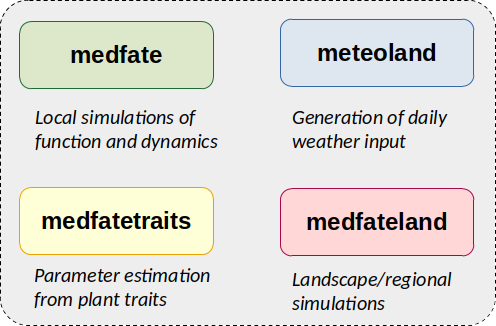

```{r setup, echo = FALSE}

knitr::opts_chunk$set(collapse = TRUE, comment = "#>", fig.path = "README-")
```

# From plant traits to model parameters <a href="https://emf-creaf.github.io/traits4models/"></a>

  <!-- badges: start -->
  [](https://github.com/emf-creaf/traits4models/actions/workflows/R-CMD-check.yaml)
  <!-- badges: end -->

## Introduction

Package **traits4models** is designed to facilitate creating plant species parameter tables for process-based models of forest function and/or dynamics. Specifically utility functions are provided to harmonize plant trait data bases and defining tables from them. At present, species parameter estimation is tailored to be used for the models included in packages [**medfate**](https://emf-creaf.github.io/medfate) and [**medfateland**](https://emf-creaf.github.io/medfateland), but it other functions could be added to become useful for other process-based models. 

## Package installation

Since both packages evolve together, installing **traits4models** normally requires an up-to-date version of package [**medfate**](https://emf-creaf.github.io/medfate), which is available at [CRAN](https://cran.r-project.org/package=medfate). 

The latest stable versions GitHub as follows (required package `remotes`` should be installed/updated first):

```{r installation, eval = FALSE}
remotes::install_github("emf-creaf/traits4models")
```


## Usage

IMPORTANT: The package is still under active development. 

## Documentation

A number of *vignettes* illustrate how to initialize inputs and run simulation models in **traits4models**. These can be found at the package [website](https://emf-creaf.github.io/traits4models/).

## Companion R packages

The development of **traits4models** is intended to complement packages [**medfate**](https://emf-creaf.github.io/medfate) and [**medfateland**](https://emf-creaf.github.io/medfateland). 

Two other packages complete the simulation framework, but can be used for many other purposes beyond forest modelling:

  + Package [**meteoland**](https://emf-creaf.github.io/meteoland) allows generating daily weather input for simulation models in **medfate** and **medfateland**. Package **meteoland** is a dependency for **medfate** and **medfateland**, but can be used independently to obtain daily weather data.
  + Package [**forestables**](https://emf-creaf.github.io/forestables) allows reading and harmonizing forest inventory data to a common data structure. Initialization workflows in **medfateland** can use data from **forestables**, but the data structures of the package can be used for many studies beyond modelling.

The relationships between the five packages are illustrated in the figure below, where black arrows indicate package dependencies and gray arrows indicate model parameter or data provision.

```{r, out.width='80%', fig.align="center", echo=FALSE}

```


## Authorship

The set of R packages are developed and maintained by the [*Ecosystem Modelling Facility*](https://emf.creaf.cat) unit at [*CREAF*](https://www.creaf.cat/) (in Spain), in close collaboration with researchers from [*URFM-INRAE*](https://www6.paca.inrae.fr/ecologie_des_forets_mediterraneennes/) (in France) and [*CTFC*](https://www.ctfc.cat/) (in Spain).

```{r, out.width='60%', fig.align="center", echo=FALSE}

```


## Funding

+ **Research project**: Boosting process-based models to project forest dynamics and associated ecosystem services at stand-to-regional scales (BOMFORES). **Financial Entity**: Ministerio de Ciencia e Innovación (PID2021-126679OB-I00). **Duration from**: 01/09/2022 **to**: 31/08/2024. **PI**: Miquel De Cáceres.
